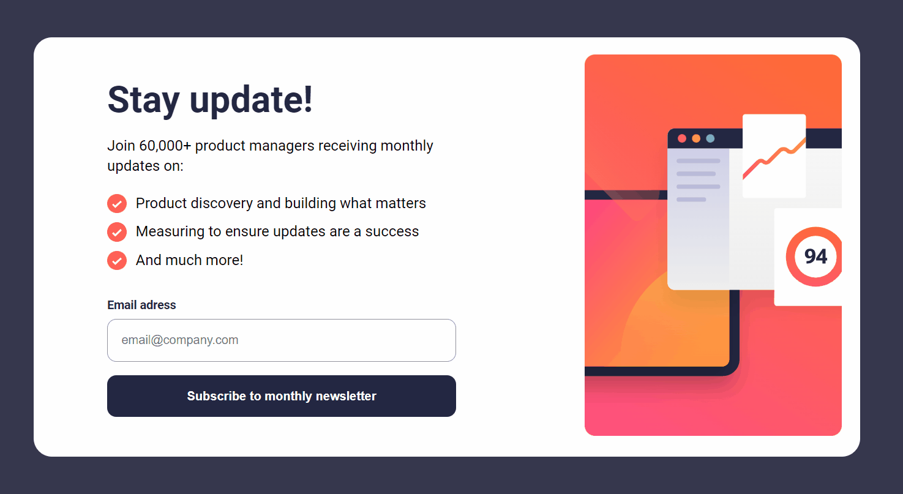
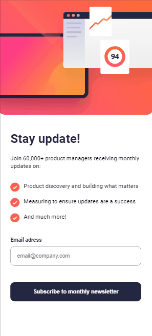

# Newsletter-sign-up
Este desafio foi retirado do site Frontend Mentor.   [Clique aqui](https://www.frontendmentor.io/challenges/newsletter-signup-form-with-success-message-3FC1AZbNrv) para conferir o desafio.

## Do que se trata esse desafio?
Trata-se de um formulário com validação no campo de e-mail.

## Quais validações devem ser feitas?
- O usuário não conseguirá enviar o formulário caso o campo email esteja vazio.
- O usuário deve preencher um email válido.
  
## Habilidades desenvolvidas:
- Uso de tags semânticas para construção do formulário.
- Uso de flexbox para ajustes dos elementos na tela.
- Uso e manipulação dos elementos no JavaScript através do DOM.
- Uso de funções, eventos,condicionais e regex.
- Uso de mediaqueries para responsividade.

## Linguagens Utilizadas:
- HTML 

- CSS  

- JAVASCRIPT  
          

## Veja como ficou:

### Desktop:
 
 
### Mobile:
  

Para ver o projeto pronto, [clique aqui!](https://jessica-os.github.io/Newsletter-sign-up/)
